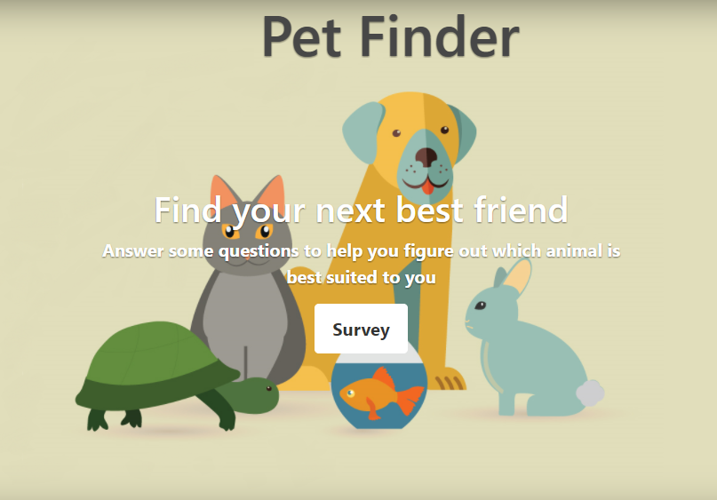

### FriendFinder 
***

###### Node and Express Servers Application
 
A full stack web application to help people Determine the most compatible pet.

***

The user will take a 10 questions personality servay, then the app will compare the results to the database to determine the most suited animal for them. The application utilizes Express, NodeJS, and JS.

See the App live on Heroku <https://finderfriend.herokuapp.com/>

#### Technologies Used:
***

* nodeJS
* Express
* bootstrap
* jQuery
* HTML
* CSS

